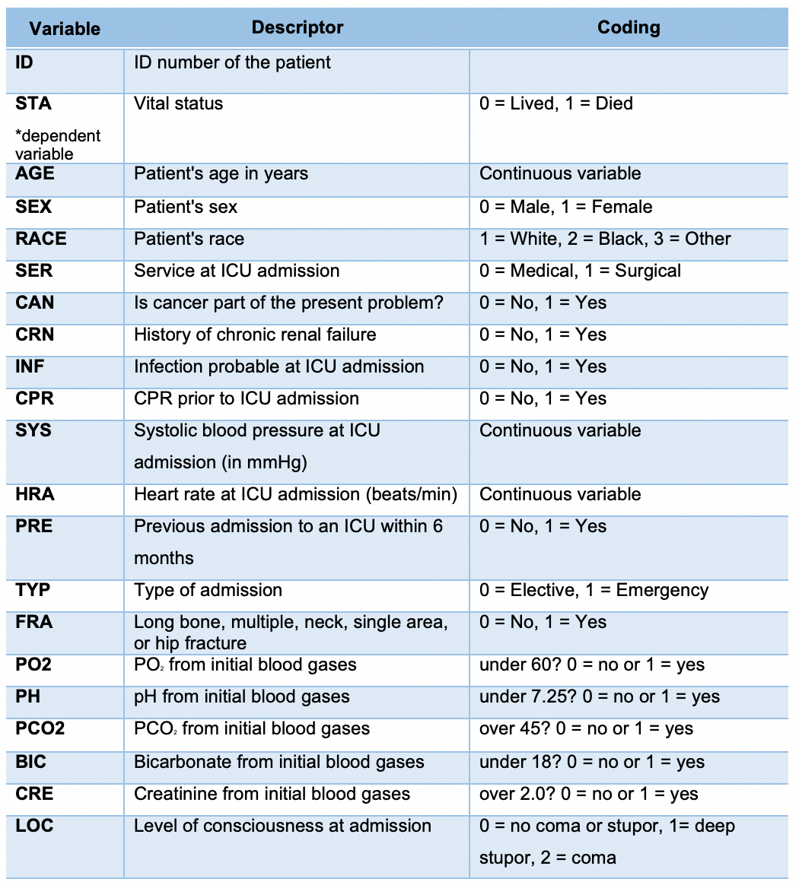

```{r setup, include=FALSE}
knitr::opts_chunk$set(echo =FALSE, message=FALSE, warning=FALSE, error=FALSE)
library(Rcmdr)
library(car)
library(RcmdrMisc)
library (ggplot2)
library (sjPlot)
library (multcomp)
library (multcompView)
library (DescTools)
library (tidyr)
library(rsample, pos=21)
library(sjstats)
library(ggplot2, pos=18)
library(sjPlot, pos=19)
library(randomForest, pos=20)
library(tidyr, pos=21)
library(rsample, pos=21)
library(DT, pos=23)
library(dplyr)
library(jtools)
library(magrittr)
library(RcmdrMisc)
library(Rcmdr)
library(kableExtra)
library(sjlabelled)
library(sjmisc)
library(devtools)
devtools::install_github("strengejacke/strengejacke")
library(strengejacke)
library(sjPlot)
library(sjstats, pos=22)
library(ggplot2)
library(qwraps2)
library(gplots)
library(data.table)
library(tidyverse)
library(kableExtra)
library(ggthemes)
library(sjPlot)
library(sjlabelled)
library(sjmisc)
library(ggplot2)
library(Rcmdr)
library(car)
library(RcmdrMisc)
library (ggplot2)
library (sjPlot)
library (multcomp)
library (multcompView)
library (DescTools)
library (tidyr)
library (plotly)

icu <- read.table("icu_factored.csv", header=TRUE, sep=",", na.strings="NA", dec=".", strip.white=TRUE)

icu <- within(icu, {
  Consciousness <- 
  factor(Consciousness, 
  labels=c('Conscious',
  'Unconscious', 'Unconscious'))
})
```

#Executive Summary
The goal of this study was to develop a statistical model to predict the probability of mortality rates for adult patients admitted to the ICU and study risks factors associated with the hospital discharge of these patients. 

Our objective was to develop a statistical methodology which would provide insight into adult patient survival prognosis upon admission to the ICU. 

Our methodology for this study was to generate and validate a statistical model for predicting hospital mortality of ICU patients, based on a subset sample of 200 patients that we were provided from an original data set containing 2734 patients. We tested for normality and association of independent variables to vital status (our dependent variable) at hospital discharge using the following tests: (1) Shapiro-Wilks, (2) Wilcoxon rank-sum test, (3) Kruskal-Wallis, (4) Lambda test for independence, (5) Chi-squared test of independence with categorical variables, (6) Spearman’s rank, (7) Correlation matrix, and (8) Multiple logistic regression analyses. 

Our analysis identified five key predictor variables for mortality rates of adult patients admitted to the ICU: consciousness (unconscious), age, systolic, type (emergency), and cancer (yes). The variables are listed in order of most to least statistically significant respectively. Based on odds ratios of our training model, level of consciousness at admission (coma/deep stupor) is the greatest predictor of vital status. A patient admitted to the ICU is 92.7 times more likely to have a vital status of 1 (died) if they have a coma or deep stupor consciousness level.

In order to test the generalizability and accuracy of our methodology, we developed a training and testing model. The key findings from applying our training model to our testing model were highlighted in a classification table. The table compared the predicted outcome to the actual outcome of vital status at hospital discharge, with 0.50 as a predictive cutoff point. This means that those with a value less than or equal to 50% were predicted to live, and those greater than 50% were predicted to die. Overall, we found our statistical model was not a good predictor of mortality rates for adults upon admission to the ICU. Our accuracy rate of predicting the survival of a patient based upon the 19 predictor variables was very low, at 15.9%. At this time we do not recommend the use of our model in a clinical setting to identify individual patient survival rates upon admission to the ICU. Our recommendation is to re-test our model with an increased sample size in order to make the data set more robust and increase statistical power. 


#Introduction
For our final eH705 project, we were provided a data set titled ICU admissions, which originated from the study Predicting the Outcome of Intensive Care Unit Patients by Lemeshow, Teres, Avrunin, and Pastides (1988). Our objective was to predict the mortality rate of adult patients admitted to the ICU using a subset of data collected by Lemeshow et al. (1988). 
We were provided with 19 different predictor variables, collected by nurses from patients admitted to the adult general ICU at Baystate Medical Center in Springfield, Massachusetts between February 1 – August 15, 1983. Our data set consisted of ID values for 200 patients, a binary dependent variable of vital status, three continuous variables of age, systolic blood pressure and heart rate, as well as 16 categorical variables of sex, race, service at ICU admission, cancer diagnosis, chronic renal failure, infection, CPR prior to admission, previous admission to ICU, type of admission, bone fracture, blood PO2, pH, PCO2, bicarbonate, creatinine, and level of consciousness. 

Objectives

Our overall objective was to study the effectiveness of ICU care by developing a reliable model as a means of assessing the differences between patient populations. A secondary objective was data reduction, specifically to identify which predictor variables to include in our final model based on their statistically significant association with the outcome of vital status.




```{r AgenGender, echo=FALSE, warning=FALSE, message=FALSE}
 
pop_pyr <- read.table("pop_pyr.csv", header=TRUE, sep=",", na.strings="NA", dec=".", strip.white=TRUE)
library("ggplot2")
ggplot(data = pop_pyr,
       mapping = aes(x = Age, fill = Sex,
                     y = ifelse(test = Sex == "Male",
                                yes = -Count, no = Count))) +
  geom_bar(stat = "identity") +
  scale_y_continuous(labels = abs, limits = max(pop_pyr$Count) * c(-1,1)) +
  labs(y = "Population") +
  coord_flip()
```


#Methodology
We used several methodologies to conduct an investigation on our subsample dataset patients upon admission to the ICU. The technology of RStudio and StatKey was leveraged to run our diagnostics. For all models, the outcome evaluated was in-hospital mortality. 

Our first step was to look at the data set, as a whole, and identify any patterns within the data set. We also converted all numeric variables to factors. Our next steps were descriptive data processing tasks to calculate and summarize our data set. We tested for normality of our continuous variables (age, heart rate and systolic blood pressure) through analysis of attributes using the Shapiro-Wilks test and the categorical variables using the Wilcoxon signed-rank test. We also looked for differences between groups by comparing difference in means using StatKey. Variance testing was completed on both continuous and categorical data using the Kruskal Wallis test of distributions. Independence testing of categorical variables was tested to find associations between variables using the lambda and chi-square tests. Furthermore, multicollinearity of predictor variables was analyzed using Spearman’s rank and a correlation matrix.

The next step in our statistical modeling process was data reduction, in order to identify the variables which were most closely associated with the outcome of status (lived or died). This allowed us to determine which variables should be included in our final model. We chose multiple logistic regression as our inferential model due to the binary nature of our dependent variable of status, with a value of zero being equivalent to a patient living and a value of one being equivalent to a patient dying. We created a training model on 70% of our sample and predicted our model’s accuracy by testing it against a 30% holding sample. For our testing model, we compared the actual and predicted values of vital status using the following null and alternative hypotheses:
Ho: The predicted values in the testing model cannot be used to predict vital status and/or hospital mortality of ICU patients, based on information available at the time of ICU admissions; the predictions of the testing model are not statistically significant.
Ha: The predicted values in the testing model can be used to predict Vital Status and/or hospital mortality of ICU patients, based on information available at the time of ICU admissions; the predictions of the testing model are statistically significant.
In terms of running a logistic regression, we had to convert all categorical variables to binary. In relation to LOC (level of consciousness) upon admission to the ICU, patients were provided one of three factors: (1) conscious, (2) coma, or (3) deep stupor. We combined coma and deep stupor into one category, relabeling the numeric factor as 0 for conscious and 1 for unconscious.


#Analysis

##Analysis of Attributes{.tabset .tabset-fade}

###Demographics

The demographic variables of the participants in this study include age, sex, and race.
<br>
<b>Race and Sex n=200</b>
```{r echo=FALSE,warning=FALSE, error=FALSE, message=FALSE}
library(lessR)
library(shiny)
selectInput("choice", label="Choose an attribute (n=200 for all):",
              choices = c("Sex","Race"),
            selected = "Sex")

choice <- reactive({
  a<-Subset(columns=input$choice, data=icu )
  return(a)
})
```
```{r echo=FALSE,warning=FALSE, error=FALSE, message=FALSE}
library(shiny)
renderPlot({
   mytable <- table(choice())
lbls <- paste(names(mytable), "\n", mytable, sep="")
pie(mytable, labels = lbls)
}
)
```

<b> Age </b>
```{r message=FALSE, warning=FALSE, error=FALSE, echo=FALSE }
# Change line color and fill color
ggplot(icu, aes(x=Age))+
  geom_density(color="darkblue", fill="lightblue")+
  labs(title = "Distribution of Age")+
  xlab("Age (Years)") + ylab("Density")
```

```{r message=FALSE, warning=FALSE, error=FALSE, echo=FALSE, include=FALSE}
labs <- c(paste(seq(0, 95, by = 5), seq(0 + 5 - 1, 100 - 1, by = 5),
                sep = "-"), paste(100, "+", sep = ""))
icu$AgeGroup <- cut(icu$Age, breaks = c(seq(0, 100, by = 5), Inf), labels = labs, right = FALSE)


SurT<-table(icu$Status)


round(100*prop.table(SurT),digits=0)
cross<-table(icu$Status,icu$AgeGroup)
round(prop.table(cross,2)*100,digits=0)
```
```{r}
barplot(prop.table(cross,2)*100,
xlab='Age',ylab='Percentages',main="Percentage survival by
Age",col=c("lightblue","lightcyan"),
legend=rownames(cross), args.legend = list(x = "topright"))
```


####Conclusion
<br>
Based on analysis of the demographics of the participants in the study, it can be concluded that a majority of participants are male, and white. In addition, majority of the participants in the study are above the age of 50 with a smaller density of the population less than 25. This indicates that there isn't a normal distribution for the participants in this study because there are two distinct populations in the distribution.
<br>
In addition, the graph above that shows the percentage survival by age shows that in all age categories except 90-94 there are more participants that lived than died, and that in general younger participants in the study were more likely to live compared to older participants.


###Admissions
The admissions variables in this study include service, type and previous.
<br>
Service: Medical or elective.
<br>
Previous: Admission into the ICU in the last 6 months
<br>
Type: Elective or emergency admission.
<br>
<b> Admission</b>
```{r echo = FALSE}
library(lessR)
library(shiny)
selectInput("choice2", label="Choose an attribute (n=200 for all):",
              choices = c("Service","Previous","Type"),
            selected = "Service")

choice2 <- reactive({
  a<-Subset(columns=input$choice2, data=icu )
  return(a)
})
```
```{r echo=FALSE}
library(shiny)
renderPlot({
mytable2 <- table(choice2())
lbls2 <- paste(names(mytable2), "\n", mytable2, sep="")
pie2<-pie(mytable2, labels = lbls2)
pie2
}

)
```

#### Conclusion

Analysis of the graphs above indicate that a majority of participants had not been admitted into the ICU in the last 6 months and that the majority of the admissions were emergency admissions. In addition a majority of the type of service provided to participants were surgical, though the difference was not substantial (107 vs 93)


###Clinical
The clinical variables in this study include continuous variables like systolic blood pressure and heart rate as well as binary variables such as cancer, renal failure, pH, PCO2, PO2, bicarbonate, consciousness, infection, creatinine, CPR, and fracture.
<br>

```{r echo = FALSE}


selectInput("choice3", label="Choose an attribute (n=200 for all):",
              choices = c("HeartRate","Systolic"),
            selected = "HeartRate")

choice3 <- reactive({
   a<-Subset(columns=input$choice3, data=icu )
  return(a)
})
```
```{r echo=FALSE}
 
renderPlot({
  mydataframe<-data.frame(choice3())
 ggplot(mydataframe, aes(x=mydataframe[,1]))+
    
  geom_density(color="darkblue", fill="lightblue")
})
```
The graph above shows that heart rates of participants in this study is not normally distributed and skewed towards the 75. However, considering that the average normal resting heart rate of individuals is between 60 and 100 beats per minute, this can be justified and this indicates that a majority of the sample had normal resting heart rates. 
<br>
The graph above shows that a majority of participants had a systolic blood pressure around 127 mmHg. Considering that the normal systolic blood pressure is 120 mmHg, this indicates that a large portion of the sample had systolic blood pressures above the normal level. 
<br>
<b>Clinical n=200</>
```{r echo = FALSE}
library(lessR)
library(shiny)
selectInput("choice4", label="Choose an attribute (n=200 for all):",
              choices = c("Cancer","Renal", "Infection","CPR", "Fracture", "PO2", "PH","PCO2", "Bicarbonate","Creatinine", "Consciousness"),
            selected = "Cancer")

choice4 <- reactive({
  a<-Subset(columns=input$choice4, data=icu )
  return(a)
})
```
```{r echo=FALSE}
library(shiny)
renderPlot({
   mytable <- table(choice4())
lbls <- paste(names(mytable), "\n", mytable, sep="")
pie(mytable, labels = lbls)
}


)
```


#### Conclusion
From the graphs above the following conclusions can be made:
- A majority of the participants in the study do not have cancer involved
<br>
- A majority of the participants in the study do not have renal failure
<br>
- A majority of the participants in the study do not have infection involved
<br>
- A majority of the participants in the study did not have CPR prior to admission
<br>
- A majority of the participants in the study did not have a fractred bone
<br>
- A majority of the participants in the study did not have partial oxygen levels from blood gases under 60.
<br>
- A majority of the participants in the study did not have a pH from blood gas under 7.25. Normal blood pH levels is 7.38. This indicates that a majority of participants did not have acidic blood but this does not suggest that participants did not have alkaline blood.
<br>
- A majority of the participants in the study did not have partial carbon dioxide levels from blood gas over 45. Normal CO2 levels in the blood are 38-42 mmHg therefore, this indicates that participants did not have dangerous CO2 levels in thier blood.
<br>
- A majority of participants in the study did not have bicarbonate from blood gas under 18. Normal bicarbonate levels are 22 mEq/L. Therefore, the results indicate that a majority of participants did not have dangerously low levels of bicarbonate but could have had higher than normal levels.
<br>
- A majority of participants in the study did not have a creatinine from blood gas over 2.0 mg/dL. Normal creatinine levels in the blood are between 0.6 - 1.2 mg/dL. Therefore participants did not have abnormally high levels of creatinine in thier blood.
<br>
- A majority of participants in the study were not in a coma or deep stupor, but there were more coma participants than those in a deep stupor
<br>


##Uniformity
```{r echo = FALSE}


require(ggplot2)

    selectInput("choice5", label="Choose an attribute (n=200 for all):",
              choices = c("Status","Sex","Race","Service","Cancer","Renal","Infection","CPR","Type","Fracture","PO2","PH","Cancer","Creatinine", "Consciousness","PCO2"),
            selected = "Status")
    
     choice5 <- reactive({
  a<-Subset(columns=input$choice5, data=icu )
  return(a)
})


  renderPlot({
      mytable <- table(choice5())
      mydataframe <- data.frame(mytable)
      ggplot(data=mydataframe,aes(x=Var1,y=Freq)) + 
        geom_bar(stat="identity", fill="cadetblue2") +
         annotate("text", x = 0, y = 10, label = "n=200")+
        labs(x=input$choice5)
      

})


```

#### Conclusion
Based on the graphs and resuts for the chi-squared tests above, the P-Values of all variables are less than 0.05 which means that the null hypotheses can be rejected. This indicates that the variable are not uniformly distirbuted The exception to this is the variable service which has a P-Value greater than 0.05 which indicates that the null hypothesis cannot be rejected. Based on this we can conclude that the variable service is uniformly distributed.
</p>

## Normality Tests

To test for noramilty of the continuous variables age, heart rate, and systolic blood pressure the Shapiro Wilks test was used. The distribution of the data was mapped using a QQ plot.

Ho: Variable is normally distributed. P-Value > 0.05
<br>
Ha: Variable is not normally distributed. P- Value <0.05

```{r echo=FALSE, message=FALSE,error=FALSE}
library(epiDisplay)

selectInput("choice6", label="Choose an attribute (n=200 for all):",
              choices = c("Age","Systolic","HeartRate"),
            selected = "Age")

choice6 <- reactive({
  a<-Subset(columns=input$choice6, data=icu )
  return(a)
})
```
```{r echo=FALSE, message=FALSE, error=FALSE}

renderPlot({
  mydataframe<-data.frame(choice6())

shapiro.qqnorm(mydataframe[,1], ylab=input$choice6, title(main=paste("Normal Q-Q Plot of", input$choice6, " n=200", sep=" ")))

})

```
Based on the Shapiro-Wilk test, since the p-value is < 0.05, the null hypothesis can be rejected. Therefore, it can be concluded that age is not normally distributed.
From the Shapiro-Wilk test of the systolic blood pressure continuous variable, the P-Value was determined to be 0.02. Since this value is less than 0.05 we can reject the null hypothesis and conclude that systolic blood pressure is not normally distributed.
Based on the Shapiro-Wilk test of heart rate, the P-Value was determined to be 0.045. Since this value is less than 0.05 we can reject the null hypothesis and conclude that heart rate is not normally distributed. 

```{r message=FALSE, warning=FALSE, error=FALSE }
normalityTest(~HeartRate, 
 test="ad.test", data=icu)
```

Because the P-Value obtained from Shapiro-Wilk test was close 0.05 the Anderson-Darling normality test was conducted to further investigate the normality of the heart rate data. The P-Value obtained from the Anderson-Darling normality test was 0.027 which is less than 0.05 meaning we can reject the null hypothesis and conclude that heart rate is not normally distributed.

### Conclusion
<br>
The continuous variables age, systolic blood pressure and heart rate are all not normally distributed. 


## Correlation


Measuring the strength of assocition between two quantitative variables:
<br>
The quantitative variables in this study are heart rate, age and systolic blood pressure. Correlational analyses are used to look at the relationships between two varaibles to determine if the two variables are related to each other. Because age, heart rate and systolic blood pressure are all not normally distributed, the spearman's rank correlation coefficient was used to test correaltion between these variables.

### Spearman Correlation 

```{r message=FALSE, warning=FALSE, error=FALSE }
library (Hmisc)

sjp.corr(icu[,c("Age","HeartRate","Systolic")], corr.method="spearman")

rcorr.adjust(icu[,
  c("Age","HeartRate","Systolic"
    )], type="spearman", 
  use="complete")
```


###Heart Rate and Systolic Blood Pressure
```{r message=FALSE, warning=FALSE, error=FALSE }
library(plotly) 
p <- ggplot(icu, aes(HeartRate,Systolic)) + geom_point()
 ggplotly(p)
```


Ho: Systolic and HeartRate are not correlated.P-value> 0.05.
<br>
Ha: Systolic and HeartRate are correlated. P-value<0.05.
<br>
Based on the table above, we can cannot reject the null hypothesis because the p-value is greater than 0.05. Therefore we conclude that systolic and heart rate are not correlated.
<br>
Based on the table above, we can cannot reject the null hypothesis because the p-value of 0.4630  is greater than 0.05. Therefore we conclude that heart rate and systolic blood pressure are not correlated. 
<br>
Systolic blood pressure and heart rate have a correlation value of -0.0522 which is a weak negative correlation and means that 5.22% of the variation in systolic blood pressure is due to heart rate and vice versa. This is seen in the graph above which shows no distinct correlation between heart rate and systolic blood pressure. Based on this it can be concluded that none of the variation in systolic blood pressure is due to variation in heart rate.

### Age and Systolic Blood Pressure
```{r message=FALSE, warning=FALSE, error=FALSE }
library(plotly) 
p <- ggplot(icu, aes(Age,Systolic)) + geom_point()
 ggplotly(p)
```
Hypothesis Testing:
<br>
Ho: Age and Systolic Blood Pressure are not correlated.P-value> 0.05.
<br>
Ha: Age and Systolic Blood pressure are correlated. P-value<0.05.
<br>
Conclusion:
<br>
Based on the table above, we can cannot reject the null hypothesis because the p-value of  0.4540 is greater than 0.05. Therefore we conclude that age and systolic blood pressure are not correlated. 
<br>
Systolic blood pressure and age have a correlation value of 0.0532 which is a weak positive correlation and means that 5.32% of the variation in systolic blood pressure is due to age and vice versa. This is seen in the graph above which shows no distinct correlation between age and systolic blood pressure. Based on this it can be concluded that none of the variation in systolic blood pressure is due to variation in age.


### HeartRate and Age
```{r message=FALSE, warning=FALSE, error=FALSE }
library(plotly) 
p <- ggplot(icu, aes(Age,HeartRate)) + geom_point()
 ggplotly(p)
```
Hypothesis Testing:
<br>
Ho: Age and HeartRate are not correlated.P-value> 0.05.
<br>
Ha: Age and HeartRate are correlated. P-value<0.05.
<br>
Conclusion:
Based on the table above, we can cannot reject the null hypothesis because the p-value of 0.8089 is greater than 0.05. Therefore we conclude that age and heart rate are not correlated. <br>
Heart rate and age have a correlation value of 0.0172 which is a weak positive correlation and means that 1.72% of the variation in heart rate is due to age and vice versa. This is seen in the graph above which shows no distinct correlation between age and heart rate. Based on this it can be concluded that none of the variation in heart rate is due to variation in age. 
<br>

To test the correlation between categorical variables dummy variables were used.
```{r}
library(corrplot)
icu_notfactored <- read.csv("http://cybr.mcmaster.ca/eH705_W2019/ICUAdmissions.csv") 

res1 <- cor.mtest(icu_notfactored, conf.level = .95)
M <- cor(icu_notfactored)
corrplot(M, method = "square",p.mat = res1$p, sig.level = 0.05)
```


From the correlation matrix above, we can conclude that there is a strong and significant correlation between the variables:

* Type and service
* Consciousness and status
* Consciousness and CPR
* PO2 and PCO2
* PCO2 and PH

The 'X' represent correlation between variables that are not significant. Therefore, these relationships must be considered during regression analysis.


### Conclusion
<br>
The variables age, heart rate, and systolic blood pressure are all not correlated with each other. 


###Proportions

Ho: The proportions of bicarbonate are not different
Ha: Proportions are different

```{r}
local({
  .Table <- xtabs(~ Bicarbonate , data= icu )
  cat("\nFrequency counts (test is for first level):\n")
  print(.Table)
  prop.test(rbind(.Table), alternative='two.sided', p=.5, conf.level=.95, 
  correct=FALSE)
})
```
P value <0.05, reject null hypothesis and conclude that the proportions of bicarbonate are different 

Ho: The proportions of cancer are not different
Ha: Proportions are different

```{r}
local({
  .Table <- xtabs(~ Bicarbonate , data= icu )
  cat("\nFrequency counts (test is for first level):\n")
  print(.Table)
  prop.test(rbind(.Table), alternative='two.sided', p=.5, conf.level=.95, 
  correct=FALSE)
})
```

P value < 0.05, reject null hypothesis and conclude the proportions of having cancer vs not having cancer are different. 

Ho: The proportions of CPR are not different

Ha: Proportions are different

```{r}
local({
  .Table <- xtabs(~ CPR , data= icu )
  cat("\nFrequency counts (test is for first level):\n")
  print(.Table)
  prop.test(rbind(.Table), alternative='two.sided', p=.5, conf.level=.95, 
  correct=FALSE)
})
```
P value < 0.05, reject null hypothesis and conclude the proportions of having CPR prior to ICU vs not having CPR are different. 

Ho: The proportions of creatinine are not different

Ha: Proportions are different

```{r}
local({
  .Table <- xtabs(~ Creatinine , data= icu )
  cat("\nFrequency counts (test is for first level):\n")
  print(.Table)
  prop.test(rbind(.Table), alternative='two.sided', p=.5, conf.level=.95, 
  correct=FALSE)
})
```

P value < 0.05, reject null hypothesis and conclude the proportions of having high creatinine vs normal creatinine are different.

Ho: The proportions of fracture are not different

Ha: Proportions are different


```{r}
local({
  .Table <- xtabs(~ Fracture , data= icu )
  cat("\nFrequency counts (test is for first level):\n")
  print(.Table)
  prop.test(rbind(.Table), alternative='two.sided', p=.5, conf.level=.95, 
  correct=FALSE)
})
```

P value < 0.05, reject null hypothesis and conclude the proportions of having a fracture vs not are different. 

Ho: The proportions of infection are not different

Ha: Proportions are different


```{r}
local({
  .Table <- xtabs(~ Infection , data= icu )
  cat("\nFrequency counts (test is for first level):\n")
  print(.Table)
  prop.test(rbind(.Table), alternative='two.sided', p=.5, conf.level=.95, 
  correct=FALSE)
})
```

P value < 0.05, reject null hypothesis and conclude the proportions of having a probable infection at ICU admission vs not are different. 

Ho: The proportions of PCO2 are not different

Ha: Proportions are different


```{r}
local({
  .Table <- xtabs(~ PCO2 , data= icu )
  cat("\nFrequency counts (test is for first level):\n")
  print(.Table)
  prop.test(rbind(.Table), alternative='two.sided', p=.5, conf.level=.95, 
  correct=FALSE)
})
```

P value < 0.05, reject null hypothesis and conclude the proportions of high PCO2 and normal PCO2 are different. 

Ho: The proportions of PH are not different

Ha: Proportions are different

```{r}
local({
  .Table <- xtabs(~ PH , data= icu )
  cat("\nFrequency counts (test is for first level):\n")
  print(.Table)
  prop.test(rbind(.Table), alternative='two.sided', p=.5, conf.level=.95, 
  correct=FALSE)
})
```

P value < 0.05, reject null hypothesis and conclude the proportions of high PH and normal PH are different. 

Ho: The proportions of PO2 are not different

Ha: Proportions are different


```{r}
local({
  .Table <- xtabs(~ PO2 , data= icu )
  cat("\nFrequency counts (test is for first level):\n")
  print(.Table)
  prop.test(rbind(.Table), alternative='two.sided', p=.5, conf.level=.95, 
  correct=FALSE)
})
```
P value < 0.05, reject null hypothesis and conclude the proportions of high PO2 and normal PO2 are different. 


Ho: The proportions of previous are not different

Ha: Proportions are different

```{r}
local({
  .Table <- xtabs(~ Previous , data= icu )
  cat("\nFrequency counts (test is for first level):\n")
  print(.Table)
  prop.test(rbind(.Table), alternative='two.sided', p=.5, conf.level=.95, 
  correct=FALSE)
})
```

P value < 0.05, reject null hypothesis and conclude the proportions of having a previous admission to the ICU in the last 6 months vs not are different. 


Ho: The proportions of renal are not different

Ha: Proportions are different

```{r}
local({
  .Table <- xtabs(~ Renal , data= icu )
  cat("\nFrequency counts (test is for first level):\n")
  print(.Table)
  prop.test(rbind(.Table), alternative='two.sided', p=.5, conf.level=.95, 
  correct=FALSE)
})
```

P value < 0.05, reject null hypothesis and conclude the proportions of renal are different. 

Ho: The proportions of service are not different

Ha: Proportions are different

```{r}
local({
  .Table <- xtabs(~ Service , data= icu )
  cat("\nFrequency counts (test is for first level):\n")
  print(.Table)
  prop.test(rbind(.Table), alternative='two.sided', p=.5, conf.level=.95, 
  correct=FALSE)
})
```

P value >0.05, do not reject null hypothesis and conclude the proportions of medical vs surgical service are the same. 


Ho: The proportions of sex are not different

Ha: Proportions are different

```{r}
local({
  .Table <- xtabs(~ Sex , data= icu )
  cat("\nFrequency counts (test is for first level):\n")
  print(.Table)
  prop.test(rbind(.Table), alternative='two.sided', p=.5, conf.level=.95, 
  correct=FALSE)
})
```

P value <0.05, reject null hypothesis and conclude the proportions of females vs males are not the same. 

Ho: The proportions of status are not different

Ha: Proportions are different

```{r}
local({
  .Table <- xtabs(~ Status , data= icu )
  cat("\nFrequency counts (test is for first level):\n")
  print(.Table)
  prop.test(rbind(.Table), alternative='two.sided', p=.5, conf.level=.95, 
  correct=FALSE)
})
```

P value <0.05, reject null hypothesis and conclude the proportions of vital signs lived vs died are not the same. 

Ho: The proportions of type are not different

Ha: Proportions are different

```{r}
local({
  .Table <- xtabs(~ Type , data= icu )
  cat("\nFrequency counts (test is for first level):\n")
  print(.Table)
  prop.test(rbind(.Table), alternative='two.sided', p=.5, conf.level=.95, 
  correct=FALSE)
})
```

P value <0.05, reject null hypothesis and conclude the proportions of elective vs emergency admission are not the same. 

In conclusion, the proportions of bicarbonate, cancer, CPR, creatinine, infection, PCO2, PH, PO2, renal, sex, status, and type are not the same. However, the catagories of fracture, previous, and service have the same proportions.

### Kruskal-Wallis

Ho: The distribution of age is the same regardless of status

Ha: The distribution of age is not the same regardless of status

```{r echo=FALSE}
with(icu, tapply(Age, Status, median, na.rm=TRUE))
kruskal.test(Age ~ Status, data=icu)
```

P value < 0.05, reject the null hypothesis and conclide that the distribution of age is not the same regardless of status. 


Ho: The distribution of heartrate is the same regardless of status

Ha: The distribution of heartrate is not the same regardless of status

```{r echo=FALSE}
with(icu, tapply(HeartRate, Status, median, na.rm=TRUE))
kruskal.test(HeartRate ~ Status, data=icu)
```

P value >0.05, do not reject the null hypothesis and conclude that the distribution of heart rate is the same regardless of status.


Ho: The distribution of systolic is the same regardless of status

Ha: The distribution of systolic is not the same regardless of status

```{r echo=FALSE}
with(icu, tapply(Systolic, Status, median, na.rm=TRUE))
kruskal.test(Systolic ~ Status, data=icu)
```

P value <0.05, reject the null hypothesis and conclude that the distribution of systolic is not the same regardless of status. 


### Chi Square


```{r echo=FALSE}
pacman::p_load(sjPlot)
```

Check Goodman-Kruskall Tau first first then check chi square. 0 = no increase in ability to predict dependent. 1= 100% certain predict correctly 


#### Calculate Lamda
Ho: Lambda = 0, i.e., variable does not help to predict status, α= 0.05

Ha: Lambda ≠ 0, i.e., variable does help to status 


```{r}
attach(icu)
library(shiny)
  selectInput("choice8", label="Choose an attribute:",
              choices = c("Age","Sex","Race","Service","Cancer","Renal","Infection","CPR","Type","Fracture","PO2","PH","Cancer","Creatinine", "Consciousness","PCO2"),
            selected = "Age")

     choice8 <- reactive({
  a<-Subset(columns=input$choice8,data=icu )
  return(a)
})


  renderText({
    v<-as.data.frame(choice8())
    vv<-table(icu$Status, v[,1])
    library(DescTools)
    #GoodmanKruskalTau(vv, direction="row")
    Lambda(vv, direction="row")

})

```

Age, CPR, and Consciousness all reject null hypothesis, variables can significantly predict status. All other variables lambda=0 fail to reject null hypothesis. 

Now check Chi-Square.

####Calculate Chi-Square {.tabset}

Ho: No association between Status and Variable

Ha: Association

#####Age
```{r echo=FALSE}
sjt.xtab(icu$Age, icu$Status, 
      show.col.prc=TRUE)
```

#####Race
```{r echo=FALSE}
sjt.xtab(icu$Race, icu$Status, 
      show.col.prc=TRUE)
```

#####Sex
```{r echo=FALSE}
sjt.xtab(icu$Sex, icu$Status, 
      show.col.prc=TRUE)
```

#####Service
```{r echo=FALSE}
sjt.xtab(icu$Service, icu$Status, 
      show.col.prc=TRUE)
```

#####Cancer
```{r echo=FALSE}
sjt.xtab(icu$Cancer, icu$Status, 
      show.col.prc=TRUE)
```

#####Renal
```{r echo=FALSE}
sjt.xtab(icu$Renal, icu$Status, 
      show.col.prc=TRUE)
```

#####Infection
```{r echo=FALSE}
sjt.xtab(icu$Infection, icu$Status, 
      show.col.prc=TRUE)
```

#####CPR
```{r echo=FALSE}
sjt.xtab(icu$CPR, icu$Status, 
      show.col.prc=TRUE)
```

#####Systolic
```{r echo=FALSE}
sjt.xtab(icu$Systolic, icu$Status, 
      show.col.prc=TRUE)
```
#####HeartRate
```{r echo=FALSE}
sjt.xtab(icu$HeartRate, icu$Status, 
      show.col.prc=TRUE)
```

#####Previous
```{r echo=FALSE}
sjt.xtab(icu$Previous, icu$Status, 
      show.col.prc=TRUE)
```

#####Type
```{r echo=FALSE}
sjt.xtab(icu$Type, icu$Status, 
      show.col.prc=TRUE)
```

#####Fracture
```{r echo=FALSE}
sjt.xtab(icu$PO2, icu$Status, 
      show.col.prc=TRUE)
```

#####PO2
```{r echo=FALSE}
sjt.xtab(icu$PO2, icu$Status, 
      show.col.prc=TRUE)
```

#####PH
```{r echo=FALSE}
sjt.xtab(icu$PH, icu$Status, 
      show.col.prc=TRUE)
```

#####PCO2
```{r echo=FALSE}
sjt.xtab(icu$PCO2, icu$Status, 
      show.col.prc=TRUE)
```

#####Bicarbonate
```{r echo=FALSE}
sjt.xtab(icu$Bicarbonate, icu$Status, 
      show.col.prc=TRUE)
```

#####Creatinine
```{r echo=FALSE}
sjt.xtab(icu$Creatinine, icu$Status, 
      show.col.prc=TRUE)
```

#####Consciousness
```{r echo=FALSE}
sjt.xtab(icu$Consciousness, icu$Status, 
      show.col.prc=TRUE)
```
In conclusion, service, renal, infection, CPR, Type, Creatinine and conciousness each have an association to Status.

##Wilcoxon Signed-Rank Test

We chose to the non-parametric Wilcoxon Signed-Rank test to compare outcomes in two independent groups. A non-parametric test is recommended in this scenario because we have a small sample size and our continuous variables (age, heart rate, and systolic bp) are not normally distributed, therefore we cannot rely on the Central Limit Theorem to test our samples.

The Wilcoxon Signed-Rank test is a paired-difference test which allowed us to compare the sample median of each continuous variables (set as the dependent variable) against with a hypothetical median, telling us if the samples have the same shape.

Ho: The two samples are equal; the distributions are the same.
Ha: The two samples are not equal; the distributions are not the same.

*Table W.1. CPR prior to admission to the ICU compared with Age*
```{r}
with(icu, tapply(Age, CPR, median, na.rm=TRUE))
wilcox.test(Age ~ CPR, alternative="two.sided", data=icu)
```

p-value = 0.7775; p-value > 0.05 alpha error, so we cannot reject the null hypothesis
Therefore, we conclude the distribution of age is the same for those had CPR prior to ICU admission with those who did not have CPR. 

*Table W.2. Vital Status of Lived or Died compared with Age*
```{r}
with(icu, tapply(Age, Status, median, na.rm=TRUE))
wilcox.test(Age ~ Status, alternative="two.sided", data=icu)
```
p-value = 0.01112; p-value < 0.05 alpha error, so we reject the null hypothesis
Therefore, we conclude the distribution of age is not the same for those patients who lived and those who died. 

*Table W.3. Cancer present at time of ICU admission compared with Age*
```{r}
with(icu, tapply(Age, Cancer, median, na.rm=TRUE))
wilcox.test(Age ~ Cancer, alternative="two.sided", data=icu)
```
p-value = 0.5782; p-value > 0.05 alpha error, so we cannot reject the null hypothesis
Therefore, we conclude the distribution of age is the same for those patients who who had cancer upon time of admission to those who did not. 

*Table W.4. Infection present at time of ICU admission compared with Heart Rate*
```{r}
with(icu, tapply(HeartRate, Infection, median, na.rm=TRUE))
wilcox.test(HeartRate ~ Infection, alternative="two.sided", data=icu)
```
p-value = 6.952 x 10^-6^; p-value < 0.05 alpha error, so we reject the null hypothesis
Therefore, we conclude the distribution is not the same for patient heart rate at ICU admission for those with an infection and those who did not have in infection.

In conclusion, our results from the Wilcoxon Signed Rank Test provided two unequal and two equal distributions. The distribution for the median age of those who lived or died (vital status) are not the same. The distribution for the median heart rate for those with an infection or without an infection were not the same. Alternatively, the distribution of the median age for those who had cancer or did not were the same. In addition, the distribution of the median age for individuals who did or did not receive CPR prior to admission to the ICU were the same.In conclusion, our results from the Wilcoxon Signed Rank Test provided two unequal and two equal distributions. The distribution for the median age of those who lived or died (vital status) were not the same. The distribution for the median heart rate for those with an infection (or without an infection) were not the same. Alternatively, the distribution of the median age for those who had cancer (or did not) were the same. In addition, the distribution of the median age for individuals who did receive CPR prior to admission to the ICU (or did not) were the same.


##Outliers

```{r echo=FALSE}
library(mvoutlier)
outliers <- aq.plot(icu[c("HeartRate","Age")])
#outliers # show list of outliers 
```

There are 20 outliers in the data Heartrate-Age

```{r echo=FALSE}
library(mvoutlier)
outliers <- aq.plot(icu[c("HeartRate","Systolic")])
#outliers # show list of outliers 
```

There are 8 outliers in the data heartrate-systolic.

```{r echo=FALSE}
library(mvoutlier)
outliers <- aq.plot(icu[c("Age","Systolic")])
#outliers # show list of outliers 
```

There are 0 outliers in the data age-systolic. 


##Predictive Model

###Individual Models{.tabset}
####Demographic Model
```{r echo=FALSE, message=FALSE, warning=FALSE}
DemographicModel <- glm(Status ~ Age + 
  + Race  + Sex , family=binomial(logit), 
  data=icu)

tab_model(DemographicModel)


 plot_model(DemographicModel, show.values=TRUE, value.offset = .3)
 
 ##lets look at just age
```
From the model above just age is significant. If we take it by itself lets see what happens.

```{r echo=FALSE, message=FALSE, warning=FALSE}
DemographicModel2 <- glm(Status ~ Age, family=binomial(logit), 
  data=icu)

tab_model(DemographicModel2)


 plot_model(DemographicModel2, show.values=TRUE, value.offset = .3)
 
 
```
Age is still significant. 


####Admissions Model

```{r echo=FALSE, message=FALSE, warning=FALSE}

AdmissionsModel <- glm(Status ~   Consciousness + CPR + 
   + Previous + Service + Type, family=binomial(logit), 
  data=icu)

tab_model(AdmissionsModel)


 plot_model(AdmissionsModel, show.values=TRUE, value.offset = .3)

 ##From this we keep Consciousness and Type
```
From the model above Consciousness and Type are significant. We will make a model with these two only. 

```{r echo=FALSE, message=FALSE, warning=FALSE}
AdmissionsModel2 <- glm(Status ~   Consciousness + 
    Type, family=binomial(logit), 
  data=icu)

tab_model(AdmissionsModel2)


 plot_model(AdmissionsModel2, show.values=TRUE, value.offset = .3)
 
 ##Still both significant
```

From the model above both consciousness and type are still both significant. 

#### Clinical Model
```{r echo=FALSE, message=FALSE, warning=FALSE}
ClinicalModel <- glm(Status ~  Bicarbonate + Cancer +  
  Creatinine + Fracture + HeartRate + Infection + PCO2 + PH + PO2 + Renal  +  Systolic , family=binomial(logit), 
  data=icu)
tab_model(ClinicalModel)


 plot_model(ClinicalModel, show.values=TRUE, value.offset = .3)
 
 ##From this we keep Systolic
```

From the model above only Systolic is significant. We will try a model with just Systolic.

```{r echo=FALSE, message=FALSE, warning=FALSE}
ClinicalModel2 <- glm(Status ~    Systolic , family=binomial(logit), 
  data=icu)

tab_model(ClinicalModel2)


 plot_model(ClinicalModel2, show.values=TRUE, value.offset = .3)
 
```
Systolic is still significant. 

###Full Model

```{r echo=FALSE, message=FALSE, warning=FALSE}
FullModel <- glm(Status ~ Age + Bicarbonate + Cancer + Consciousness + CPR + 
  Creatinine + Fracture + HeartRate + Infection + PCO2 + PH + PO2 + Previous 
  + Race + Renal + Service + Sex + Systolic + Type, family=binomial(logit), 
  data=icu)

tab_model(FullModel)


 plot_model(FullModel, show.values=TRUE, value.offset = .3)
 
 ##From this we keep age Cancer and Consciousness and Type
```


```{r echo=FALSE, message=FALSE, warning=FALSE}
FullModel2 <- glm(Status ~ Age  + Cancer + Consciousness +Type, family=binomial(logit), 
  data=icu)

tab_model(FullModel2)


 plot_model(FullModel2, show.values=TRUE, value.offset = .3)
 
 ##From this we keep age Cancer and Consciousness and Type
```

The model above show that Age, Cancer, Consciousness and Type are all significant. 

```{r echo=FALSE, warning=FALSE, message=FALSE, results=FALSE}
#stepwise(FullModel, direction='forward/backward', criterion='BIC')
# ##doesn't get Cancer
```

We completed our own linear regresssion using the five statistically significant variables identified in the last model aboce of Cancer, Age, Type, Consciousness.  
We then verified our findings by using a Step-Wise Forward-Backward Bayesian Regression Model
    + The BIC model showed that 3 out of the 4 variables were significan so we will run the test again:
        + we achived the same AIC score of 169.4.
        + the independent variables identified as significant (indicated by a minus sign) were the same.

 In conclusion, our logistic regression analysis leads us to find the best predictors of Vital Status for patients admitted to the ICU are: (1) Cancer, (2) Age, (3) Type, (4) Consciousness.


```{r, echo=FALSE, message-FALSE, warning=FALSE, eval=FALSE}
# icu <- within(icu, {FullModel2 <- fitted(FullModel2) 
# })
```

### Training and Testing

* Logistic regression models are trying to predict as well as possible.
* To better test how the model will work in reality, we train the model on 70% of the sample and hold 30% aside to test as “new” sample. We will predict values of the dependent variable in the “holdout” sample using the model built on the “training” sample.
* We will use the Regression on the findings from the training sample to predict group membership among those in the “testing” sample.
    + The training & test samples are kept separate so that we can objectively test the quality of the modeling and prediction.

Splitting the dataset into training sample (70%) and testing sample (30%).
```{r echo=FALSE, warning=FALSE, message=FALSE}
set.seed(0)
train_test_split <- initial_split(icu, prop = 0.7)
train <- training(train_test_split)
test <- testing(train_test_split)
```

```{r, echo=FALSE, message=FALSE, warning=FALSE}
Train <- glm(Status ~  Age + Type + Consciousness, 
  family=binomial(logit), data=train)
 
tab_model(Train)
```

```{r, echo=FALSE, message=FALSE, warning=FALSE}
Train <- glm(Status ~  Age + Type + Consciousness, 
  family=binomial(logit), data=train)
 
tab_model(Train)
```


```{r echo=FALSE, message=FALSE, warning=FALSE}
predicted <- predict(Train, newdata=test  ) # # 
actual <- test$Status  # actual Intention to Return for the testing sample
x <- as.data.frame(cbind(actual, predicted))  
```

The correlation for the actual versus predicted values is below
```{r echo=FALSE, message=FALSE, warning=FALSE}
cor.test(x$actual,x$predicted) # hypothesis test for correlation
```

A plot of actual versus predicted is below along with a model of a linear regression between the two.
```{r echo=FALSE, message=FALSE, warning=FALSE}
ggplot(data=x, aes(x=predicted, y=actual)) + 
  geom_jitter(width=0.15) +
  geom_smooth(method=lm)

actualvpredict <- lm(actual ~ predicted, x)
tab_model(actualvpredict)
```

###Correlation Conclusion
In conclusion, we found that the variables Age, Type and Consciousness predict status.


# Key Findings
We used our training model to predict our testing model, and compared the actual and predicted values of vital status in the testing sample to created the following null and alternative hypotheses:
Ho: The predicted values in the testing model cannot be used to predict Vital Status and/or hospital mortality of ICU patients, based on information available at the time of ICU admissions; the predictions of the testing model are not statistically significant.
Ha: The predicted values in the testing model can be used to predict Vital Status and/or hospital mortality of ICU patients, based on information available at the time of ICU admissions; the predictions of the testing model are statistically significant.
Our training model is an improvement upon our BIC logistic regression model as the significance of each variable based upon p-values aligns with the predictability of the odds ratios. In addition, our AIC value is the lowest at a value of 101.18, with the inclusion of systolic. Based on the above information, we reject the null hypothesis and state cancer(yes), age, type(emergency), consciousness(unconscious), and systolic do predict hospital mortality of ICU patients, based on information available at the time of ICU admissions.
We completed a statistical analysis on a data set consisting of 200 adult patients with information collected on 19 health predictors. The predictor variables were analysed for correlation with our response variable of vital status. Our stated objective was to create a statistical methodology which would provide insight into adult patient prognosis after admission to the ICU. 
Important findings were gathered through our logistic regression training model, assessed on 70% of our sample, and then tested for accuracy on the remaining 30%. Our logistic analysis identified five statistically significant independent variables which can be used to predict the likelihood of a patient to survive when admitted to the ICU. The predictor variables are consciousness level of a patient, patient age, blood pressure, presence of cancer and admission type as emergency (vs. medical). Based on the odds ratios, the strongest predictor of mortality is consciousness, where patients admitted to the ICU in a coma or deep stupor are 92.7 times more likely to die.

Health interpretations from our findings are most robust from the data analyzed during our final inferential statistics stage of logistic regression. Our goal was to determine if vital status differs significantly based upon the five statistically significant variables we identified using a stepwise BIC logistic regression on our training model. We attempted to infer this difference based on probability, by running our training model on our testing model .

```{r}
tab_model(actualvpredict)
```


To interpret our health findings we used the given R-squared results. R-squared is also called the coefficient of determination and represents the differences between the actual data and the predicted values. R-squared values always fall between 0 and 100%. A value of 0% represents a model that does not explain any of the variation in vital status around it’s mean. While a value of 100% represents a model that explains all of the variation in vital status around its mean. 

We chose to use the adjusted R-squared value instead of the R-squared because it improves the accuracy of our health model. Adjusted R-squared increases if a new predictor variable improves the model more than would occur by chance. It decreases when a predictor improves the model by less than would occur by chance. 

Our final model achieved an adjusted R-squared value of 0.067, or 6.7%. As we know, values closer to 100% provide explain all correlation between our dependent and independent variable. Our adjusted R-squared of 6.7% is very low which indicates our model is not a good predictor of survival upon admission to the ICU. However, the above p-value for this model is 0.026, which is much smaller than a Type 1 alpha error level of 0.05. The small p-value does  allow us to reject the null hypothesis with 95% confidence. 

Therefore, we cannot confidently state that the variables of consciousness, age, systolic, emergency type and cancer can be used to predict patient mortality rates upon admission to the ICU. Based on the low accuracy level or our model, the finding are not generalizable to a larger population. However, it would be worth further investigation of the five identified statistically significant variables we identified of consciousness level of a patient, patient age, blood pressure, presence of cancer and admission type as emergency (vs. medical). These variables have been shown to be positively correlated to mortality rates upon ICU admission, and with a larger data set further associations may be discovered. 
	


# Limitations 
Our sample size for this study of n=200, originated from a total sample of n=2734. The small size of our sample led to several issues.  A small sample size leads to lower statistical power when performing analysis on the data. A low statistical power can also reduce the likelihood of achieving results that have a true effect on the population. In terms of logistic regression, our BIC analysis works best when the number of participants (n) is much larger than the number of variables studied (k). In our analysis, the number of participants (n=200) is approximately 10 times larger than the number of variables (k=19). Ideally, n would be a larger value to trust our BIC regression analysis. Finally, a great deal of time and effort went into the analysis of this data, which is inefficient in terms of time as the results are less reliable.
Lemeshow et al. (1988) advocated not to use the model to predict survival rated beyond the time of admission to the ICU, or to predict the length of a patient’s stay in the ICU. In addition, Lemeshow et al. (1988) stated this model only has potential predictive power on general admission to the ICU, and cannot be used in specialized units. 
Further limitations include removal of the following patient populations from the data set: coronary care, cardiac surgery, burn patients, and patients under 14. The removal of this patient population limits the generalizability of the data set. In addition, there is a subjective and biased nature to data collected by nurses which may lead to errors in diagnostics. The data used in our analysis study have a high error rate which makes them unacceptable for clinical decision making in relation to individual patients survival rates upon admission to the ICU. Finally, higher than expected death rates may be due to unforeseen catastrophic events which occured in the ICU late in admission, and were not detected during early ICU admission.


#Health Recommendation Strategy 
	The greatest predictor of mortality rates were patients admitted the ICU in a coma or deep stupor. The least statistically significant predictor of mortality rates upon admission to the ICU was a patient having cancer. In 1988, Lemeshow, Teres, Spitz Avrunin, and Pastides developed a model to compare the effectiveness of ICU treatment across a variety of patient populations. However, based on our findings, we do not recommend making critical care assessments for adults admitted to the ICU based on this model. However, we do recommend further analysis of the variables we identified as highly correlated with predicting ICU mortality rates of consciousness (unconscious), age, systolic, type(emergency), and cancer(yes). 


#References
Lemeshow, S., Teres, D., Spitz Avrunin, J., & Pastides, H. (1988). Predicting the Outcome of Intensive Care Unit Patients. Journal of the American Statistical Association, 83(402), 348–356.
